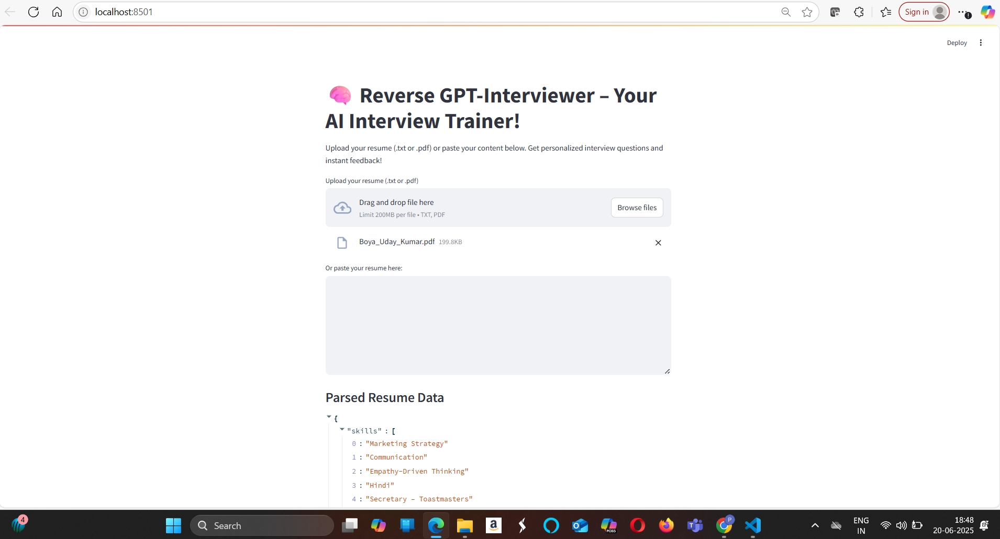

# Day 66: Reverse GPT-Interviewer – AI-Powered Interview Practice App

## Overview

**Reverse GPT-Interviewer** is a Streamlit web application that transforms your resume into a personalized interview training experience. Upload your resume (as a .txt or .pdf file) or paste its content, and the app will:

- Parse your skills, experience, and projects
- Generate tailored interview questions
- Provide instant, STAR-method-based feedback on your answers
- Track your progress
- Allow you to export your Q&A and feedback for further review

This project demonstrates advanced resume parsing, interactive UI design, and AI-driven feedback—all in a single, user-friendly app.

---

## Features

- **Flexible Resume Input:**
  - Upload your resume as a `.txt` or `.pdf` file
  - Paste your resume content directly
  - Use a built-in example resume for instant demo/testing

- **Robust Resume Parsing:**
  - Extracts skills, experience, and projects using strict filters to avoid irrelevant or nonsensical entries
  - Handles various resume formats and ignores contact info, numbers, and common stopwords

- **Personalized Interview Questions:**
  - Generates questions for each parsed skill, experience, and project
  - Includes general behavioral questions

- **STAR-Based Feedback Engine:**
  - Analyzes your answers for Situation, Task, Action, and Result
  - Provides color-coded, actionable feedback (success, warning, error, info)
  - Encourages detailed, structured responses

- **Progress Tracking & Export:**
  - Visual progress bar as you answer questions
  - Download your Q&A and feedback as a `.txt` file for offline review

---

## How to Use

1. **Install Requirements:**
   ```bash
   pip install streamlit PyPDF2
   ```

2. **Run the App:**
   ```bash
   streamlit run reverse_interviewer_app.py
   ```

3. **Interact:**
   - Upload or paste your resume, or use the example
   - Review parsed data
   - Answer the generated questions
   - Read the instant feedback and improve your responses
   - Download your results when finished

---

## Example



---

## File Structure

- `reverse_interviewer_app.py` – Main Streamlit app
- `README.md` – This documentation

---

## Dependencies

- [streamlit](https://streamlit.io/)
- [PyPDF2](https://pypi.org/project/PyPDF2/)

---

## Credits & Inspiration

- Inspired by real-world interview preparation needs and the power of AI feedback

---

## Next Steps / Ideas

- Enhance resume parsing with advanced NLP (e.g., spaCy, transformers)
- Integrate OpenAI or LLM-based feedback for deeper analysis
- Add support for more file formats and richer export options

---

**Enjoy practicing and refining your interview skills with AI!**
