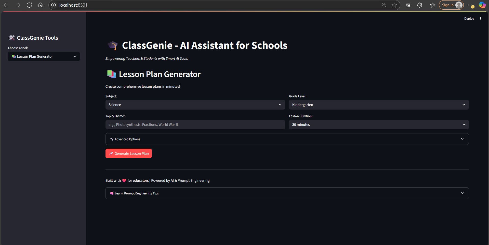
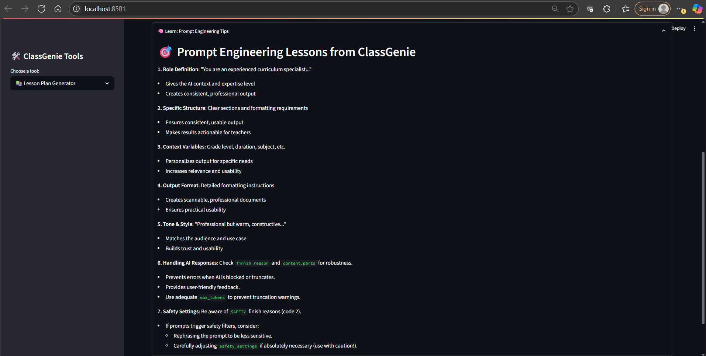
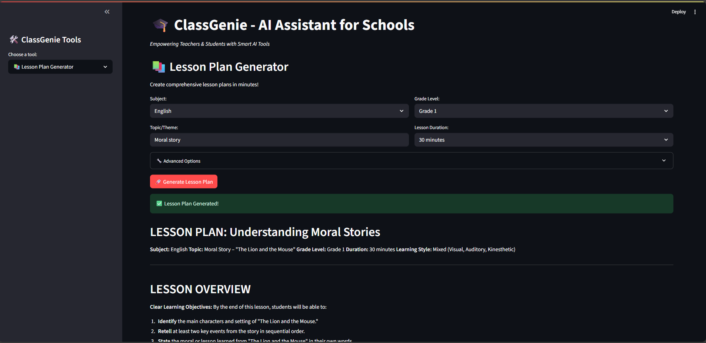
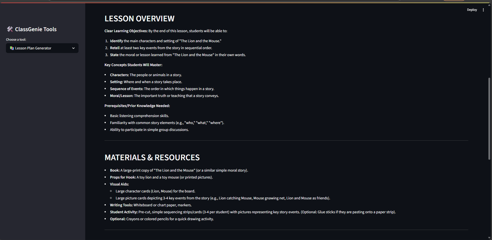
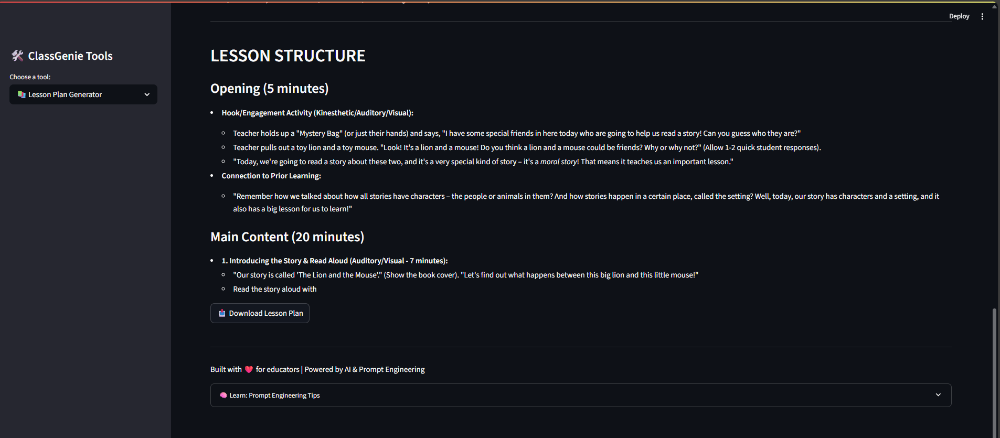

# 📚 AI-Powered Lesson Plan Generator - Day 70

An intelligent tool that helps teachers, educators, and trainers generate structured and personalized lesson plans in seconds using AI. Just input your subject, grade, topic, and learning objectives — and let the generator do the rest!

---

## 🚀 Features

- ✅ **Instant Lesson Plan Generation**
- 🧠 **AI-Powered Output** – Uses GPT to generate well-structured plans
- ✏️ **Customizable Inputs** – Subject, class level, topic, and objectives
- 📋 **Structured Output** – Includes key sections like:
  - Topic
  - Grade/Class
  - Objectives
  - Activities
  - Assessment Methods
  - Materials Needed
- 💡 **Simple UI** – Focused, clean, and user-friendly

---

## 🛠️ How It Works

1. Enter your lesson inputs (subject, class, topic, learning goal).
2. Click “Generate Plan”.
3. View your AI-powered lesson plan, ready for classroom use or customization.

---

## 💻 Use Cases

- Teachers preparing daily or weekly plans
- Training facilitators structuring sessions
- Parents planning home-school lessons
- Ed-tech apps offering personalized learning journeys

---

## 📸 Preview






---

## 🔮 Future Enhancements

- [ ] Share plans via email
- [ ] Add voice input
- [ ] Suggest activities based on Bloom’s Taxonomy

---

## 🤝 Contributing

Ideas or feedback are welcome! Feel free to fork this repo and suggest improvements.

---

## 🧠 Built With Passion on Day 70

This project is part of a 100-Day AI Learning Challenge to build real-world AI-powered tools every day. Day 70’s focus: **Prompt Engineering + Structured Output UI**.

---

## 📬 Contact

Reach out on GitHub or connect via [Portfolio](https://ud-ai-kumar.vercel.app/) to collaborate on educational AI projects.

```

