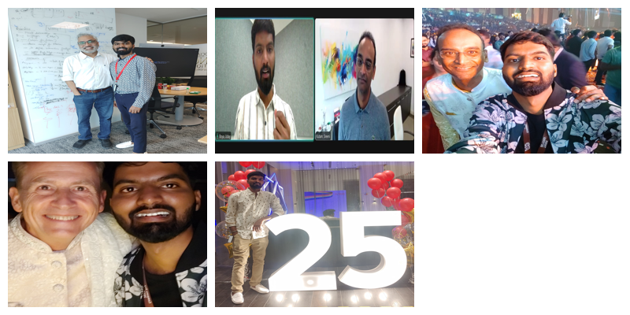
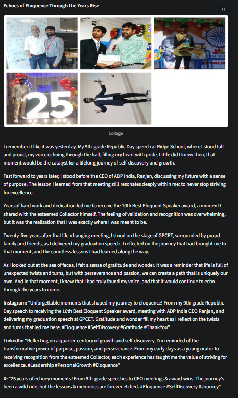

# Day 94: Memory Lane – Picture to Story App

This project was created as part of the **100 Days of Python/AI Challenge**. Day 94 is all about building something delightfully surprising and impactful—an app that turns your photos and memories into narrated, shareable stories with AI.

---

# Memory Lane: Picture to Story App

Turn your photos and memories into narrated, shareable stories with AI! Upload up to 5 images, crop and filter them, add your memories, and let the app generate a beautiful story, collage, animated carousel, and social-ready captions. Export everything as PDF or audio, and revisit your past stories—all in a modern, mobile-friendly UI.

## ✨ Features
- **Multi-image upload** (up to 5 images)
- **Image cropping and filters** (grayscale, sepia, blur)
- **Memory input for each image**
- **Drag-and-drop image reordering**
- **Collage with template selector** (Grid, Polaroid, Overlapping)
- **Animated GIF carousel**
- **Story tone selector** (Nostalgic, Funny, Poetic, Dramatic, Heartwarming)
- **AI-generated story with memory highlights**
- **AI-generated title**
- **Social captions** (Instagram, LinkedIn, X)
- **Export as PDF** (collage, story, captions)
- **Audio narration (TTS) with download**
- **Save and revisit past stories/collages in session**
- **Modern, mobile-friendly, high-contrast UI**

## 🚀 Setup
1. **Install requirements:**
   ```sh
   pip install -r requirements.txt
   ```
2. **Run the app:**
   ```sh
   streamlit run app.py
   ```
3. **(Optional) Set your Groq API key:**
   - Export `GROQ_API_KEY` as an environment variable or edit in `story_generator.py`.

## 📱 Usage
1. Upload up to 5 images.
2. Crop and filter each image, and enter your memory for each.
3. Drag to reorder images as you like.
4. Choose your collage style and story tone.
5. Click **Generate My Memory Lane Story**.
6. View your collage, animated carousel, story, and social captions.
7. Download your story as PDF or audio, and revisit past stories below.

## 🖼️ Example Output
- Collage and animated GIF of your images:
  
  
  
  
- AI-generated story and title:
  
  
- Social captions for Instagram, LinkedIn, X
- Downloadable PDF and MP3 narration:
  
  [Download Example PDF](memory_lane_story.pdf)

## 💡 Why It Matters
- **Emotional Impact:** Helps families, kids, and seniors relive and share memories in a creative, AI-powered way.
- **Educational Value:** Teaches about AI, image processing, and storytelling in a hands-on, joyful context.
- **Technical Edge:** Combines computer vision, LLMs, TTS, and modern UI/UX for a portfolio-worthy, real-world app.
- **Social Sharing:** Makes it easy to create content for Instagram, LinkedIn, and X, bridging personal memories and social media.
- **Therapeutic Use:** Can be used for memory therapy, journaling, or as a creative classroom tool.

## 💡 Inspiration
Inspired by Dribbble, Material Design, and Apple HIG for a beautiful, accessible, and mobile-first experience.

---

**Made with ❤️ for unforgettable memories.** 